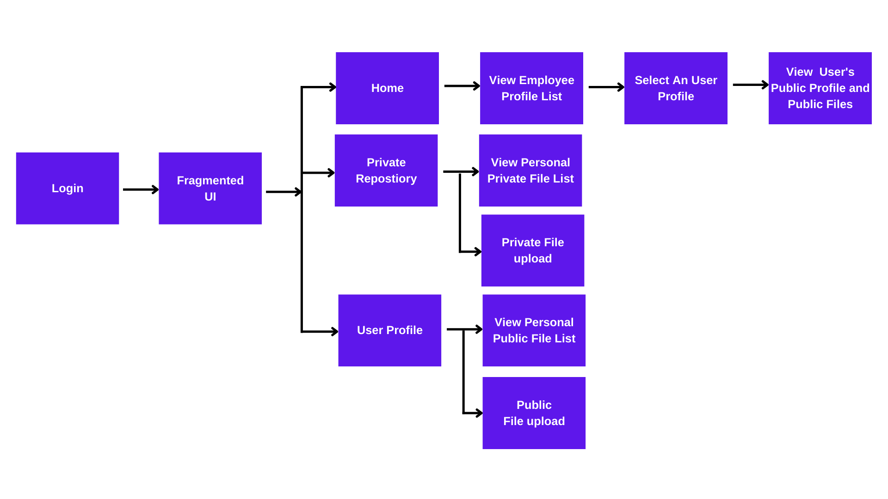

# Document-Digitization-Service

A mobile application to manage documents and files. The application is built using Native Android and Firebase Realtime database. MVC (Model View Controller) architecture is used to structure the code. It was originally part of a multi-platform application project.

## **Application Workflow** 
Users can signup/log-in using their email. Upon login an user views the home page with a bottom navigation bar. The home page is a list of employee profiles, which belong to company employeees. Pressing on the "Private repositoris user get to see the user's private files. The notification panel is planned to built for the second version. User can view his/her profile by pressing on the top-right button. In the home page pressing on any user's profile will lead to the user's public profile. Where his/her public information can be viewed as well as publicly shared files. In the private repository, user can view and upload private files. User can upload and view his/her public files by going to the user's profile. The application work-flow is demonstrated in the diagram below

## **Contributors** 

